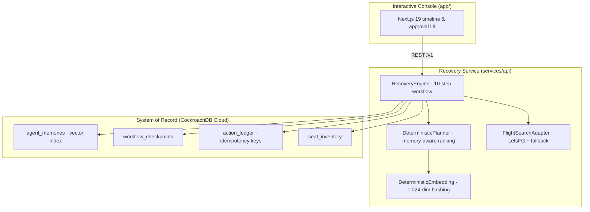

# RouteRecall

**The flight-disruption recovery agent that remembers what matters — and survives its own crashes.**


RouteRecall turns an airline cancellation into a **durable, explainable recovery workflow**. It recalls a passenger's constraints and past preferences, searches replacement flights, ranks them against what it remembers, pauses at a human approval boundary, reserves **exactly once**, and learns from the outcome — so the next disruption is handled better than the last.

The agent's memory, checkpoints, seat inventory and action ledger all live in **one CockroachDB database**, keeping vector retrieval and transactional state perfectly consistent.

## Highlights

- **Memory-augmented decision-making** — a planner that ranks flights against remembered passenger preferences (reliability over price, no red-eyes, window seats, meeting deadlines) instead of doing stateless cheapest-fare ranking
- **Distributed vector retrieval** — 1,024-dimensional feature-hashing embeddings with **no external model API**, indexed in CockroachDB via `vector_cosine_ops` and queried with cosine distance
- **Crash-safe workflows** — every step is committed to a durable `workflow_checkpoints` table; kill the agent mid-run and resume from the latest checkpoint
- **Idempotent actions** — an `action_ledger` keyed by stable idempotency keys guarantees one reservation per request, even after retries
- **No overselling** — seat inventory and its reservation entry commit in a single serializable transaction; a live race demo proves one worker wins and the other replans
- **Human-in-the-loop** — the workflow pauses at an explicit approval boundary before any reservation is made
- **Live or fallback flight search** — an optional LetsFG adapter for real search, with a deterministic bundled-offer fallback so the demo runs with zero credentials
- **Dual runtime modes** — credential-free in-memory demo mode, or full cloud mode against CockroachDB Cloud

## The demo scenario

Maya Chen's UA1847 SFO→JFK connection to London is mechanically cancelled, which would make her miss the 08:30 BST meeting in London.

1. RouteRecall recalls what it remembers about Maya: avoid red-eye departures, prefer window seats, protect the 08:30 meeting, and prioritize reliability during disruption.
2. It searches alternatives and builds a **memory-aware** recovery plan.
3. Compare **Memory ON** (BA286 — best policy fit, 91% reliability, window seat, nonstop) with **Memory OFF** (UA930 — lowest fare but red-eye and arrives after the meeting).
4. Approve the plan, then kill the agent after approval and resume it from its latest durable checkpoint.
5. Verify that one stable idempotency key produces exactly one reservation, even after a retry.
6. Run **Race for last seat**: two workers contend for the same seat — one commits, the other replans. Zero oversold seats, zero duplicate actions.

## How the agent works

A `RecoveryEngine` executes a 10-step workflow, checkpointing after every step:

| # | Step | What happens |
|---|------|--------------|
| 1 | `RECEIVE_DISRUPTION` | The disruption event (flight, route, reason, deadline) enters the case context |
| 2 | `LOAD_PASSENGER_MEMORY` | All memories for the passenger are loaded |
| 3 | `RECALL_SIMILAR_CASES` | A query embedding is built and the 3 nearest memories are retrieved via the CockroachDB vector index |
| 4 | `SEARCH_ALTERNATIVES` | Replacement itineraries come from the live flight adapter or the bundled fallback |
| 5 | `BUILD_RECOVERY_PLAN` | The planner ranks offers against recalled memory and explains its decision |
| 6 | `WAIT_FOR_APPROVAL` | Human approval boundary — no side effects happen before this step |
| 7 | `RESERVE_SEAT` | Seat + reservation entry commit in one serializable transaction under an idempotency key |
| 8 | `GENERATE_REPORT` | A report is created and recorded in the action ledger |
| 9 | `LEARN_FROM_OUTCOME` | A new memory is written back so future recoveries improve |
| 10 | `COMPLETE` | Case marked completed |

Each step runs exactly once per checkpoint — a crash between steps resumes from the last durable state, never from scratch and never mid-action.

## Architecture



### Tech stack

| Layer | Choice |
|-------|--------|
| Console | Next.js 19 / React 19 (TypeScript), deployed via Cloudflare Workers (`worker/`) |
| API | Python 3.12 · FastAPI · uvicorn |
| Agent core | Pure-Python `RecoveryEngine` + `DeterministicPlanner` — no LLM dependency at runtime |
| Database | CockroachDB Cloud — vectors, transactions, checkpoints and ledger in one system of record |
| Vector search | Local feature-hashing embeddings (SHA-256, unigram + bigram features, stop-word and canonicalization handling) with `vector_cosine_ops` |
| Flight data | Optional LetsFG live-search adapter (search-only; never books) with deterministic fallback |

## Quick start (no cloud required)

Requirements: Node.js 22+ and Python 3.12+.

Run the interactive console:

```bash
npm install
npm run dev
```

Open `http://localhost:3000`. Without a `DATABASE_URL`, the API runs in deterministic demo mode (in-memory repository, bundled offers) so every interaction works with zero credentials.

Run the workflow API:

```bash
python -m pip install -r services/api/requirements.txt
PYTHONPATH=services/api uvicorn routerecall.main:app --reload --port 8000
```

Set `NEXT_PUBLIC_API_URL=http://localhost:8000` (see `.env.example`) before starting the web console to connect it to the API.

Run the command-line scenario:

```bash
PYTHONPATH=services/api python -m routerecall.demo
```

On Windows PowerShell, use `$env:PYTHONPATH="services/api"` before the Python commands.

## CockroachDB Cloud setup

1. Create a CockroachDB Cloud cluster and a SQL user.
2. From the cluster's **Connect** dialog, copy the PostgreSQL connection string. Keep it private.
3. Copy `.env.example` to `.env`, set `DATABASE_URL`, then run the secure bootstrap:

   ```bash
   python -m pip install -r services/api/requirements.txt
   PYTHONPATH=services/api python database/bootstrap_cloud.py
   ```

   The bootstrap retains `sslmode=verify-full`, uses a trusted CA bundle, creates the schema and vector index, seeds embedded memories, and runs or reuses one cloud verification case. Its output never prints the connection string.

4. Start the API. At startup, RouteRecall inserts the demonstration offers and backfills deterministic embeddings for seed memories.
5. The repository's `.vscode/mcp.json` contains the cluster-scoped managed MCP endpoint with no secret. In VS Code, start `cockroachdb-cloud`, authenticate with OAuth, and grant read-only access for demonstrations — every read is recorded in `mcp_audit_events` (see [docs/mcp-audit.md](docs/mcp-audit.md)).

The database connection uses `sslmode=verify-full`. Do not commit `.env`, connection strings, passwords, API keys or MCP bearer tokens.

## API reference

| Method | Endpoint | Description |
|--------|----------|-------------|
| `GET` | `/health` | Liveness check; reports the runtime mode (`demo` or `cloud`) |
| `POST` | `/v1/demo/cases?memory_enabled=true` | Create a demo recovery case for the bundled passenger |
| `POST` | `/v1/cases/{case_id}/run?crash_after=RESERVE_SEAT` | Run the workflow; optionally inject a crash after a given step to exercise recovery |
| `POST` | `/v1/cases/{case_id}/resume` | Resume an interrupted case from its latest durable checkpoint |
| `GET` | `/v1/cases/{case_id}` | Return the case state plus its full action ledger |

## Tests

```bash
python -m pip install -r services/api/requirements-dev.txt
PYTHONPATH=services/api python -m unittest discover -s services/api/tests -v
npm run lint
npm test
```

The suite verifies memory-aware selection, meaningful local vector similarity, crash recovery, idempotent actions, concurrent seat contention, API behavior and the production web bundle.

## Repository map

```text
app/                         interactive reviewer console (Next.js 19)
services/api/routerecall/    workflow engine, memory, planner and DB adapters
services/api/tests/          API, retrieval and resilience tests
database/                    CockroachDB migration, bootstrap and inspection scripts
docs/                        MCP guide, demo script and project checklist
worker/                      Cloudflare Workers hosting entry point
```

Use [docs/demo-script.md](docs/demo-script.md) for the short walkthrough and [docs/submission-checklist.md](docs/submission-checklist.md) for the remaining publishing work.

## Safety and scope

This is a prototype, not an airline ticketing system. All bundled passenger details, itineraries, prices and inventory are fictional. The optional live-search adapter performs searches only; real purchase or exchange operations require an authorized airline API, explicit passenger approval and provider-specific validation.

## License

MIT — see [LICENSE](LICENSE).
